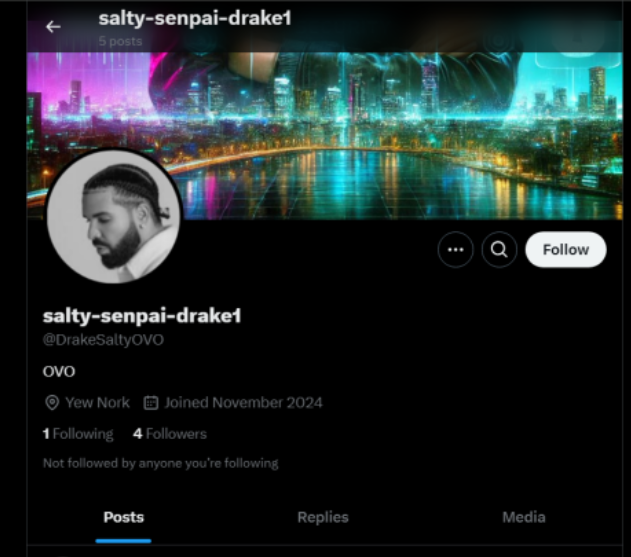
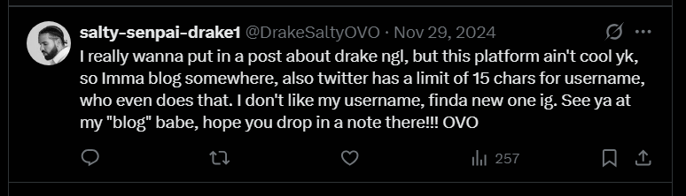

### 

## Challenge Description

 Yo, I’ve lowkey always been a Drake fan, that’s why my username’s "DrakeSaltyOVO". It was literally everywhere on my dashboard until I had to take it down 'cause people just kept hating. But, like, that’s one thing I’ve always related to with my guy Drake, and honestly, I’ve been an even bigger fan ever since. 😂 Ya, laugh all you want, but I’m literally the only one with the flag fr, rofl! 

## Points

300

## Solved Date

February 27th, 9:58:18 PM UTC+9

## Solving Steps

### Step 1 (Finding the platform)

The first though that comes to mind for everyone who sees the word username is to find it in a platform. My first thought was to search for the username "DrakeSaltyOVO" into Google but doing that will result in nothing

I tried searching the username in multiple platforms using URL. The first social media platform I thought about is Instagram since it's one of the most used platforms. Unfortunately, nothing appeared.

I then went on to try the second platform I thought about and it's Twitter. I plugged in this URL: <https://x.com/DrakeSaltyOVO>

I got lucky and turns out it is actually Twitter. To confirm that this was actually part of the CTF and not some random account, you can see that one of the posts referenced AceCTF's website.

### Step 2 (Analyzing the Twitter account)

Now, we move on to analyzing this account's posts. Starting from the very first post on the account. It talks about how admin wants to post about Drake on another platform since Twitter users keep roasting him about liking Drake. This means that there is another account we need to look out for.

The next clue we have is his birthday, which is in his second post. We can clearly see that it's 14 September 2000. The text in the picture that says "289 days to your next birthday" might seem misleading because it could imply that admin's birthday is on June 30 2001. But this is debunked by the second last post on the account posted on 29 November 2024 where the admin says that he's excited to turn 25 in just 289 days.

### Step 3 (Finding the new blog)

From the post before, we can see the UI of the blog website admin is trying to register in. After doing a quick Google search, the UI looks very similar to tumblr's register page.

I unfortunately made a tumblr account (turns out you don't have to and there's another website called tumbig to search for stuff in tumblr without making a tumblr account but oh well). Typing in the username "salty-senpai-drake1" will result in a blog with the same exact username. There's only a single post in that blog which is:

`N3q8ryccAAQrDS+tIAAAAAAAAABqAAAAAAAAANGqpB7VL3HfX5dq2a0oNrtZRM2Hum9ExZnUSpeMMG2rzSg6lQEEBgABCSAABwsBAAIkBvEHARJTD3GIJuGJqEfIwbSE/71QeN8hIQEAAQAMIBwACAoBra6o3QAABQEZAQAREwBmAGwAYQBnAC4AdAB4AHQAAAAZABQKAQCfS+NlYELbARUGAQAgAAAAAAA=`

If you noticed something, in the very end of the post there's a bunch of weird letters. These sets of weird letters are what's called a base4 encoding. We can deduce this by checking the string based on this format:

`^([A-Za-z0-9+/]{4})*([A-Za-z0-9+/]{3}=|[A-Za-z0-9+/]{2}==)?$`

Or you can probably just deduce it from the very end of the string, if it ends with either =, ==, or === then it is most likely base64 encoded.

### Step 4 (Decoding the base64 string)

Putting the set of strings into a base64 decoder using UTF-8, we get this decoded string:

It might seem like random symbols but notice how it starts with a 7z in the start of the string, this means that it's a 7z file. Putting the encoded set of strings into a text file and uploading it to the decoder will result in a .7z file.

### Step 5 (Extracting the .7z file)

You might think that this is the end of the challenge, but when we tried to extract the 7z and turns out you need a password to extract it. Now there is one final post in the Twitter account that I haven't mentioned and this is where it comes in.

From this post, we can know several things: The password is composed of only numbers, it's 7 characters long, and it takes 1.63 seconds to crack. We all already know where this is going. It must be the admin's birthday. If you input admin's birthday in the same exact password strength checker website it'll also result in 1.63 seconds.

Now, for the moment of truth. We have the password and now all we need to do is extract it. But turns out inputting the password "1492000" is wrong. So I tried to input all the ways 14 September 2000 would be formatted. Indeed it was all just a problem of formatting, the password is "200914"

Inside the extracted folder is a txt file named "Flag" and it contains the flag, which is: `ACECTF{y0u_b3773r_41nt_h4t3}`

## Red Herrings

While doing this challenge, my team stumbled upon a few red herrings/misleading information. Those were:

- We thought admin's birthday is 30 June 2001 because it said that it's 289 days away from the inputted birthday which is 14 September 2000. Turns out that's just how tumblr's register page worked like.
- We thought the birthday 14 September 2000 was wrong because when we tried to input it as the password, it wouldn't work. Turns out you just need to format it differently.

## Reflection

I thought this challenge was actually pretty fun. I haven't participated in a lot of CTF events and I'm just getting started. Through this challenge I learned a lot about how OSINT challenges could work and all the possibilities and factors you need to count for in searching for the flag. I hope the people who were struggling to find the flag in this challenge finally know how to do it. Good job to the problem setter too for making the Twitter account since last year.

